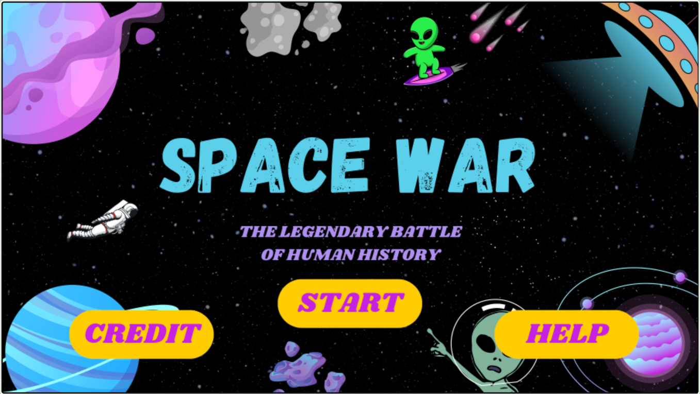

# Game Space War 🌍👾

**Game Space War** is an exciting 2D action game created with **Greenfoot** and programmed in **Java**. In this game, you play as an astronaut defending Earth from an alien invasion. Use your skills to fight off the alien forces and protect humanity!

[Check out the game on Greenfoot! 🎮](https://www.greenfoot.org/scenarios/32053)

---

## 🌟 Features
- **Thrilling Gameplay**: Control the astronaut and battle waves of invading aliens.
- **Dynamic Challenges**: Increasing difficulty as you progress through the game.
- **Interactive Design**: Immersive sound effects and engaging animations.
- **High Scores**: Compete to achieve the best score and set a new record.

---

## 📸 Game Preview
Here’s a sneak peek of the game:  


---

## 🛠️ How to Install and Play

1. Ensure you have **Greenfoot** installed on your system.  
   [Download Greenfoot here](https://www.greenfoot.org/download)

2. Clone this repository to your local machine:
   ```bash
   git clone https://github.com/ikhsannovianto/Game-Space-War.git

---

## 📜 License
This project is licensed under the **MIT License**. You can find the full text of the MIT License in the [LICENSE](LICENSE) file in this repository.
